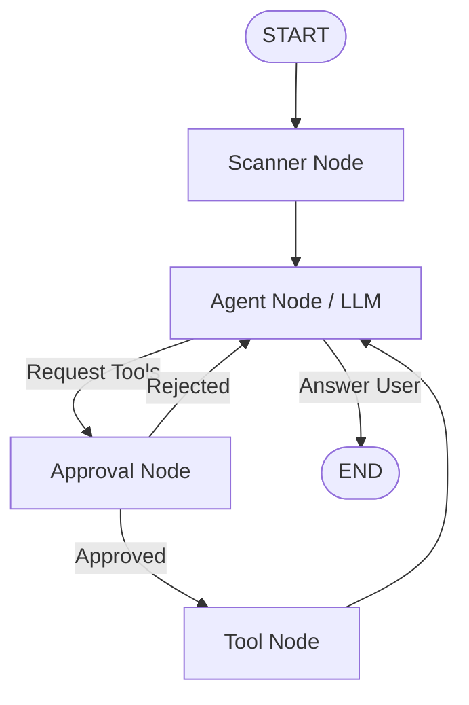

# ❖ Kaizen Code

**Kaizen Code** is an advanced, terminal-based autonomous AI software engineering agent designed to solve development tasks with surgical precision. Operating on the principle of continuous improvement (*Kaizen*), it executes tasks, runs commands, performs tests, and refactors code autonomously while maintaining perfect safety guardrails.

Built on top of a stateful **LangGraph** workflow, Kaizen Code structures its operation into five distinct phases, preventing cognitive loops and ensuring token-efficient developer collaboration.

---

## 🏛️ System Architecture Overview

Kaizen Code is built around a centralized **LangGraph** engine that maintains the state of the active developer-agent thread.



### Core Engine Components
* **`builder` ([graph.py](file:///c:/Users/DVS/OneDrive/Desktop/Kaizen/kaizen/core/engine/graph.py#L38)):** Integrates the graph workflow. It maps how nodes transfer execution control.
* **`KaizenState` ([state.py](file:///c:/Users/DVS/OneDrive/Desktop/Kaizen/kaizen/core/engine/state.py#L9)):** The schema of the shared state channel. It manages:
  * `messages`: The list of conversational message history (with `add_messages` reducer).
  * `workspace`: Absolute path of the active codebase.
  * `summary`: Running Markdown text summary of completed actions.
  * `snapshot`: Directory structure and file info.
  * `todos`: Array of active/completed task checklists.

---

## 🏛️ Dynamic Execution Flow & Nodes

Every query execution follows a structured path through the graph's nodes:

### A. Scanner Node (`scanner` in [nodes.py](file:///c:/Users/DVS/OneDrive/Desktop/Kaizen/kaizen/core/engine/nodes.py#L42))
On graph startup, the scanner runs a recursive walk of the codebase. It:
* Skips ignored extensions (`.png`, `.jpg`, `.pdf`, `.db`, etc.) and directories (`.git`, `node_modules`, `.venv`).
* Collects exact statistics: absolute paths, size in bytes, and total line counts for all source files.
* Saves a structured directory layout string to the state's `snapshot` field, giving the LLM an upfront layout map of the project.

### B. Agent Node (`agent` in [nodes.py](file:///c:/Users/DVS/OneDrive/Desktop/Kaizen/kaizen/core/engine/nodes.py#L97))
The main reasoning loop of the orchestrator.
1. **Memory Cleaner:** Before invoking the LLM, the system runs [memory_cleaner](file:///c:/Users/DVS/OneDrive/Desktop/Kaizen/kaizen/core/modules/helper/memory.py#L61). If message counts exceed 50, it removes the earliest 30 messages, compiles them into a Markdown summary, prepends this summary to the remaining history, and updates the local state.
2. **LLM Invocation:** Loads client credentials using `get_llm()` and binds tools. It then invokes the LLM using `SYSTEM_PROMPT` to analyze the snapshot and messages, returning an action recommendation.

### C. Approval Node (`approval_node` in [nodes.py](file:///c:/Users/DVS/OneDrive/Desktop/Kaizen/kaizen/core/engine/nodes.py#L122))
Acts as a security gateway.
* Inspects whether the LLM's suggested tools fall under `DANGEROUS_TOOLS` (`edit_file`, `write_file`, `terminal`).
* If dangerous, it triggers a LangGraph `interrupt`, prompting the CLI client for developer validation (`Yes` / `No` / `Feedback`).
* If the user approves, it moves to the `tool_node`. If rejected, it returns feedback to the `agent` node.

### D. Custom Tool Node (`tool_node` in [nodes.py](file:///c:/Users/DVS/OneDrive/Desktop/Kaizen/kaizen/core/engine/nodes.py#L36))
* Invokes tool functions and collects responses.
* Implements a custom wrapper that catches outputs from `write_todos`, parses the serialized checklist, and populates the graph state's `todos` channel.

---

## 🏛️ The 5-Phase Cognitive Protocol

To prevent AI agents from looping on search, reading, and editing, the orchestrator prompt forces strict phase compliance:

| Phase | Purpose | Allowed Tools | Mandate |
| :--- | :--- | :--- | :--- |
| **`PLAN`** | Task Roadmap | `write_todos` | Must initialize a todo checklist before any file operations. |
| **`LOCATE`** | Discover Files | `ripgrep`, `list_directory`, `web_search_tool` | Forbidden from reading files until a search locates the path. |
| **`INSPECT`** | Read Context | `read_file` | Reads only specific line bounds. Back-to-back reads on the same file are blocked. |
| **`APPLY`** | Apply Patches | `edit_file`, `write_file` | Applies clean modifications. Reading the file right after writing is forbidden. |
| **`VERIFY`** | Run Verification | `terminal` | Runs compilation and tests. Re-enters LOCATE/INSPECT if verification fails. |

---

## 🏛️ In-Depth Tool Specifications

### A. Ripgrep Search (`ripgrep` in [tool.py](file:///c:/Users/DVS/OneDrive/Desktop/Kaizen/kaizen/tools/ripgrep_tool/tool.py))
Executes high-performance text searches across the workspace using the `python-ripgrep` package.
* **Truncation Safeguard:** Automatically truncates search outputs at 50 matching lines to preserve context limits.
* **Colon Split Integrity:** Split limits are locked to 1 (`d.split(":", 1)`) to preserve colon characters (e.g. type hints, slices, dictionaries) inside matching code lines.

### B. Workspace Sandbox File Tools ([file_tools/](file:///c:/Users/DVS/OneDrive/Desktop/Kaizen/kaizen/tools/file_tools/))
* **Workspace Boundary Protection:** All tools use `path_resolver` which converts paths to absolute and resolves symlinks. It verifies that `resolved_path.is_relative_to(workspace_path)`. Any boundary breach raises `PermissionError`.
* **Tool Implementations:**
  * `read_file`: Enforces line pagination. If a file is larger than 1000 lines, it refuses to read without exact `start_line` and `end_line` bounds.
  * `edit_file`: Performs exact block match replacement. Old text must match the target content exactly to avoid corrupting code files.

### C. Subagents Node Parallelization ([subagent_tool.py](file:///c:/Users/DVS/OneDrive/Desktop/Kaizen/kaizen/tools/subagents/subagent_tool.py#L21))
Spawns child agents dynamically:
* Splits developer tasks into independent queries.
* Executes them in parallel using a `ThreadPoolExecutor`.
* Spawns worker subagents running a stateless version of the subagent graph (`subagent_graph`).
* Merges and reports worker results back to the Master Orchestrator.

---

## 🏛️ Storage & Database Management

Kaizen Code stores session configurations and execution checkpoints locally:

* **Config Manager (`~/.kaizen/config/settings.json`):** Manages key-value pairs for `KAIZEN_MODEL`, `KAIZEN_BASE_URL`, and `KAIZEN_API_KEY`.
* **Session Manager (`~/.kaizen/sessions/index.json`):** Holds metadata indexing active conversation thread IDs, titles, and creation timestamps.
* **Checkpoint DB (`~/.kaizen/sessions/checkpoints.db`):** An SQLite database managed by LangGraph's `SqliteSaver`. It checkpoints thread states, letting developers close the CLI and resume threads later with perfect history.

---

## 🛠️ CLI Command Reference

Once installed, control the agent using the following commands:

| Command | Description |
| :--- | :--- |
| `kaizen init` | Initializes local SQLite checkpoints and configuration folders in `~/.kaizen/`. |
| `kaizen config` | Prompts for LLM provider URL, model name, and API key, saving them securely in settings. |
| `kaizen chat` | Launches a new interactive programming session with the AI agent. |
| `kaizen resume` | Lists active sessions stored in checkpoints and lets you pick one to resume. |
| `kaizen version` | Prints the system architecture, OS platform, Python version, and Kaizen package build. |

---

## 📦 Installation

To set up Kaizen Code in your workspace, follow these steps:

### 1. Clone the repository and navigate to the directory
```bash
git clone https://github.com/arunpunithkumar3-a11y/Kaizen-Code.git
cd Kaizen-Code
```

### 2. Set up a virtual environment and install dependencies
```bash
# Create virtual environment
python -m venv .venv

# Activate virtual environment
# On Windows:
.venv\Scripts\activate
# On macOS/Linux:
source .venv/bin/activate

# Install the package in editable mode
pip install -e .
```

### 3. Initialize Kaizen
```bash
kaizen init
```

### 4. Configure your LLM credentials
```bash
kaizen config
```
*Follow the interactive prompt to set your Base URL, Model Name, and API Key.*

---

## 💻 Usage Example

Launch the agent inside your codebase:
```bash
kaizen chat
```

### Tips for Developer Collaboration
* **File References:** Type `@` inside your query to trigger a file autocomplete list of files in the workspace (e.g., `"How does the list work in @test_agent_workspace/linked_list.py?"`).
* **Checklist Roadmap:** At the start of a complex task, the agent will build and update a `write_todos` list. This structured plan is displayed as it advances.
* **Approval Check:** When the agent modifies a file or runs tests, you will be prompted:
  * `Yes`: Proceed.
  * `No`: Halt.
  * `No, and provide feedback`: Halt and pass directions (e.g., *"Wait, change the method to use a while loop instead."*).

---

## 📄 License
This project is licensed under the MIT License - see the [LICENSE](LICENSE) file for details.
